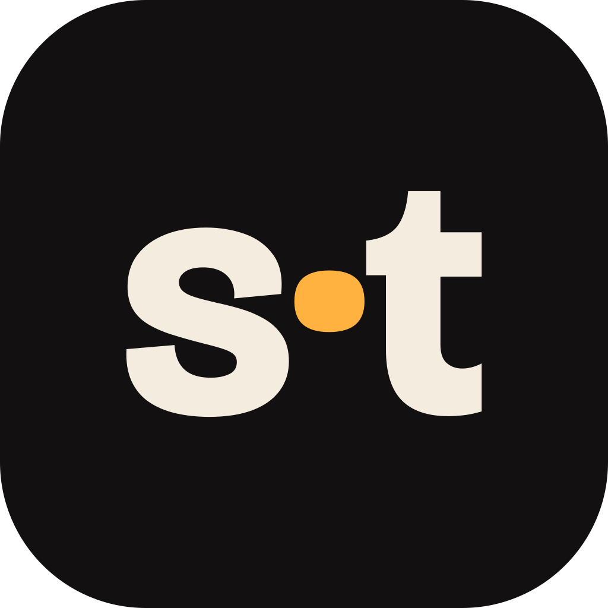

<p align="center">
  
</p>

<h1 align="center">SyncTogether</h1>

<p align="center">
  <strong>Watch videos together, perfectly in sync. Cross-platform, low-latency, and self-hostable.</strong>
</p>

<p align="center">
  <a href="#license"></a>
  
  
</p>

---

SyncTogether is a modern cross-platform application for synchronized media playback across devices. Create a **room**, share a 6-character room code (or a `synctogether://join/<code>` invite link), and keep everyone's playback in lockstep - play, pause, and seeks broadcast in real-time, accompanied by synchronized chat, animated emoji reactions, and live voice & video facecams.

## Preview

| Lobby | Theater Room |
|:---:|:---:|
|  |  |
| **Room Chat** | **Media Chooser** |
|  |  |

---

## Key Features

- **Strict Lockstep Sync** - Millisecond-level synchronization with readiness gates, host drift-correction heartbeats, and authority-answered state recovery for late joiners.
- **Two Playback Modes** - Local video files (via `media_kit` hardware-accelerated rendering with file hash mismatch warnings) and YouTube (via internal loopback IFrame bridge).
- **Voice & Video Facecams** - Multi-participant live AV tiles powered by LiveKit SFU mesh with dynamic mic/camera controls.
- **Persisted Chat & Quick Reactions** - In-room chat history, typing indicators, and Google Noto animated emoji reactions.
- **Flexible Authentication** - Instant anonymous guest accounts (protected by Cloudflare Turnstile), Sign in with Apple, Google Sign-In, or Passwordless Email OTP with seamless in-place identity upgrades.
- **Resumable & Persistent Rooms** - Dormant rooms can be resumed by the host with playback position preserved, or extended/ended on demand.
- **Self-Hosting Ready** - Deploy the complete stack (Postgres database, Realtime engine, Edge Functions, LiveKit server, Web portal) on your own infrastructure or cloud free tiers.
- **Modern Violet Glass UI** - Consistent, dark glassmorphism design system across desktop, tablet, and mobile orientations.

---

## 🚀 Self-Hosting

SyncTogether is designed to be easily self-hosted on a VPS, home server, or local LAN. Deploy the complete stack (Postgres database, Realtime engine, Edge Functions, LiveKit SFU server, and Web portal) using managed free tiers or fully self-hosted Docker containers.

> 📖 **Complete Guide**: See **[docs/self-hosting.md](docs/self-hosting.md)** for step-by-step setup, Docker Compose recipes, environment configuration, and production deployment paths.

---

## 🛠 Local Development Setup

SyncTogether includes an automated orchestrator script (`./scripts/dev.sh`) to spin up the local development stack (Supabase container stack, Edge Functions runtime, and Next.js web portal) with one command.

### Prerequisites

- [FVM](https://fvm.app) (Flutter Version Management)
- [Supabase CLI](https://supabase.com/docs/guides/cli) (`brew install supabase/tap/supabase`)
- [Docker Desktop](https://www.docker.com/) or OrbStack
- [Node.js](https://nodejs.org/) (v20+)

### Start Development Stack

```bash
# Spin up local Supabase, Edge Functions, and Next.js web portal
./scripts/dev.sh

# Run the Flutter desktop app (Instance A)
fvm flutter run -d macos

# Run an isolated second client for room testing (Instance B)
./scripts/st-instance-b.sh

# Check ecosystem health
./scripts/dev.sh status

# Spin down all services and clean up ports
./scripts/dev.sh down
```

---

## 🧪 Testing & Code Quality

SyncTogether maintains comprehensive test coverage across client, database, and web layers:

```bash
# 1. Run Flutter unit & widget tests
fvm flutter test

# 2. Run Supabase pgTAP database RPC & RLS tests
supabase start && supabase test db

# 3. Run Web application & billing webhook tests
npm --prefix website test

# 4. Run static analysis
fvm flutter analyze
```

---

## 📦 Installers & Desktop Self-Updates

Release builds and installer artifacts are built via GitHub Actions (`.github/workflows/`):
- **macOS**: DMG package with Developer ID code signing, notarization, and background auto-update.
- **Windows**: Inno Setup installer (`dart run inno_bundle`), MSIX package for Microsoft Store distribution (`publish_microsoft_store.yaml`), background auto-update, and `synctogether://` protocol registration.
- **Android**: Release APK.

---

## 📂 Repository Layout

| Directory | Description |
|---|---|
| `lib/ui/` | Violet glass design system: tokens (`PTColors`, `PTText`), buttons, inputs, loaders (`PTLoader`), dialogs |
| `lib/auth/`, `lib/profile/` | Authentication flows, Turnstile captcha bridge, user profiles, entitlement management |
| `lib/rooms/` | Lobby, room screen, participant grid, dormancy/resume engine, room service |
| `lib/sync/` | Lockstep synchronization engine (`SyncService`, `SyncBackend`, `SyncLogic`) |
| `lib/av/` | LiveKit SFU audio/video connection & facecam tiles |
| `lib/updates/` | Desktop self-update service (Sparkle / WinSparkle appcast parser, silent background updater) |
| `docs/` | In-depth technical documentation & [Self-Hosting Guide](docs/self-hosting.md) |
| `docker/` | Docker Compose and server configuration templates for self-hosting |
| `supabase/` | Database migrations (schema, RLS, RPCs, pg_cron), edge functions, auth config |
| `website/` | Next.js 16 marketing site, download portal, changelog, FAQ, and Paddle billing |
| `scripts/` | Developer environment orchestrator (`dev.sh`), clean slate reset, secrets tool, macOS signing, Instance B launcher |
| `tool/` | Asset generation scripts (audio, emoji, certificates, app icons) |

---

<a id="license"></a>
## 📄 License & Commercial Notice

SyncTogether is licensed under the **[PolyForm Noncommercial License 1.0.0 (PolyForm-Noncommercial-1.0.0)](LICENSE)**.

### What is permitted:
- ✅ **Personal & Community Self-Hosting**: You are 100% free to self-host, run, inspect, and modify SyncTogether for personal, educational, family, hobby, non-profit, or community use.
- ✅ **Contributions & Forking**: You can fork the repository, build custom features, submit pull requests, and deploy private non-commercial instances.

### What is prohibited:
- ❌ **Commercial Resale / Commercial SaaS**: You may **not** use SyncTogether for commercial purposes, sell it as your own product, package it into a commercial distribution, or offer it as a paid commercial hosted service / SaaS to third parties without an explicit commercial license from the Licensor.

---

## 👏 Credits & Third-Party Assets

- **Animated Reactions**: [Noto Animated Emoji](https://googlefonts.github.io/noto-emoji-animation/) by Google (licensed under [CC BY 4.0](https://creativecommons.org/licenses/by/4.0/)).
- **Video Playback**: [media_kit](https://github.com/media-kit/media-kit) (MPV-backed high performance player for Flutter).
- **WebRTC Mesh**: [LiveKit](https://livekit.io) real-time video and audio platform.
