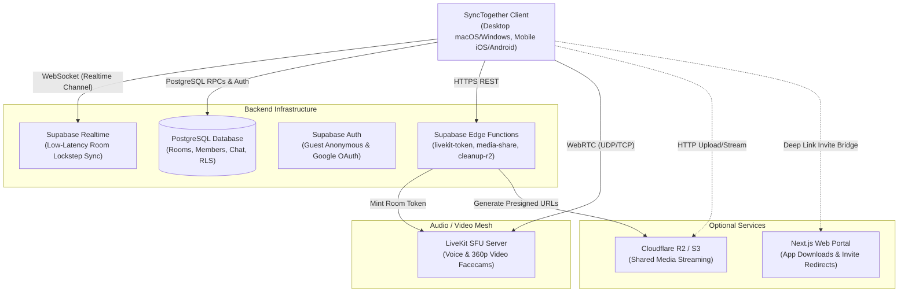

# Self-Hosting SyncTogether

This guide provides complete instructions for self-hosting your own SyncTogether infrastructure - from running on a local home server to deploying a high-availability production instance on a VPS or cloud provider.

---

## 1. System Architecture

SyncTogether consists of four modular layers designed for low latency, secure room state synchronization, and peer-to-peer AV facecams:



---

## 2. Choosing Your Deployment Path

| Method | Complexity | Infrastructure Requirements | Best For |
|---|---|---|---|
| **Path A: Managed Hybrid** *(Recommended)* | 🟢 Easy (~5 mins) | Free accounts on [Supabase](https://supabase.com) and [LiveKit Cloud](https://livekit.io) | Personal use, small friend groups, fast onboarding with zero server maintenance |
| **Path B: Fully Self-Hosted (Docker)** | 🟡 Intermediate | VPS or home server with Docker, Docker Compose, public IP or domain with TLS | Complete data ownership, private networks, offline LAN parties |

---

## 3. Prerequisites

Before starting, ensure you have the following installed on your machine:

1. **[FVM](https://fvm.app)** (Flutter Version Management) or **Flutter SDK 3.44.x+**:
   ```bash
   dart pub global activate fvm
   fvm install
   ```
2. **[Supabase CLI](https://supabase.com/docs/guides/cli)** (v2.x+):
   ```bash
   # macOS / Linux (Homebrew)
   brew install supabase/tap/supabase
   
   # Windows (Scoop)
   scoop bucket add supabase https://github.com/supabase/scoop-bucket.git
   scoop install supabase
   ```
3. **[Docker & Docker Compose](https://docs.docker.com/get-docker/)** (Required for local development and self-hosted LiveKit/Supabase).
4. **[Node.js 20+]** (Required if building/running the Next.js web portal).

---

## 4. Step-by-Step Setup Guide

### Step 1: Database & Backend (Supabase)

#### Option 1: Managed Supabase Cloud (Easiest)
1. Create a free project at [database.new](https://database.new).
2. Note your **Project URL** (`https://<project-ref>.supabase.co`) and **Publishable (anon) Key** from **Project Settings → API**.
3. Link your local repository to the project:
   ```bash
   supabase login
   supabase link --project-ref <project-ref>
   ```
4. Push all database migrations, RLS policies, stored procedures, and cron sweep jobs:
   ```bash
   supabase db push
   ```

#### Option 2: Self-Hosted Supabase Docker Stack
If self-hosting the full Supabase container stack on your own server:
1. Follow the official [Supabase Self-Hosting Guide with Docker](https://supabase.com/docs/guides/self-hosting/docker).
2. Once the container stack is active (default API gateway at `http://localhost:54321` or `https://api.yourdomain.com`), apply the SyncTogether schema:
   ```bash
   supabase db push --db-url "postgresql://postgres:<your-db-password>@<db-host>:5432/postgres"
   ```

---

### Step 2: Audio & Video Facecam Server (LiveKit)

SyncTogether uses LiveKit for ultra-low-latency voice and video facecam rails.

#### Option 1: LiveKit Cloud (Easiest)
1. Sign up for a free project at [cloud.livekit.io](https://cloud.livekit.io).
2. Retrieve your **WebSocket URL** (`wss://<your-subdomain>.livekit.cloud`), **API Key**, and **API Secret** from **Settings → Keys**.

#### Option 2: Self-Hosted LiveKit Server (Docker)
1. A ready-to-use Docker compose setup is included in the repo. Edit `docker/livekit.yaml` to set your desired API keys:
   ```yaml
   port: 7880
   rtc:
     tcp_port: 7881
     port_range_start: 50000
     port_range_end: 50100
     use_external_ip: true # Set to true on a public VPS
   keys:
     my_livekit_key: my_livekit_secret_change_me_in_production
   ```
2. Start the LiveKit server:
   ```bash
   docker compose -f docker-compose.selfhost.yml up -d
   ```
3. Ensure the following firewall ports are open on your server:
   - `7880/TCP`: HTTP / WebSocket signaling
   - `7881/TCP`: WebRTC TCP fallback
   - `50000-50100/UDP`: WebRTC media streams

---

### Step 3: Deploy Backend Edge Functions

SyncTogether uses Supabase Edge Functions to mint short-lived LiveKit JWT access tokens and manage media sharing.

1. Create or edit `supabase/functions/.env`:
   ```bash
   LIVEKIT_API_KEY=<your-livekit-api-key>
   LIVEKIT_API_SECRET=<your-livekit-api-secret>
   LIVEKIT_URL=<your-livekit-websocket-url>
   ```
2. Deploy the Edge Functions:
   ```bash
   # Deploy LiveKit token minter (required for voice/video facecams)
   supabase functions deploy livekit-token

   # Set server-side secrets in Supabase
   supabase secrets set --env-file supabase/functions/.env
   ```

*(Optional)* If you are enabling media file sharing via Cloudflare R2 / S3 storage:
```bash
supabase functions deploy media-share
supabase functions deploy cleanup-r2
```

---

### Step 4: Authentication Configuration

SyncTogether supports flexible authentication options through Supabase Auth:

1. **Anonymous Guest Sign-in**: Enabled by default. Guests receive a temporary username (`Guest-xxxx`) and can immediately create/join rooms.
   - *Cloudflare Turnstile (Optional)*: Protects against automated guest spam. To enable, create a widget in Cloudflare Turnstile, pass `TURNSTILE_SITE_KEY` via `--dart-define=TURNSTILE_SITE_KEY=...` (or `--dart-define-from-file=.env`), and configure `SUPABASE_AUTH_CAPTCHA_SECRET` in Supabase Auth settings.
2. **Google OAuth (Optional)**:
   - In your Google Cloud Console, create a **Web Application OAuth Client**.
   - Set the Authorized Redirect URI to:
     `https://<your-supabase-ref>.supabase.co/auth/v1/callback`
   - In Supabase Dashboard (**Authentication → Providers → Google**), enable Google and enter your Client ID and Client Secret.
3. **Apple Sign-In (Optional)**:
   - In Apple Developer portal, configure Sign in with Apple for your Services ID and bundle identifier (`app.synctogether`).
   - In Supabase Dashboard (**Authentication → Providers → Apple**), enable Apple with your Services ID, Team ID, Key ID, and private key.
4. **Passwordless Email OTP (Optional)**:
   - Supabase Auth supports passwordless 6-digit email OTPs or magic links out of the box. Turnstile captcha verification protects email sign-in requests against abuse.

---

### Step 5: Configure and Build Client Applications

> [!NOTE]
> **Platform Support**: Desktop builds officially target **macOS** and **Windows**. Linux desktop is currently unsupported due to upstream WebView and self-update limitations.

SyncTogether uses Flutter compile-time defines (`--dart-define`) to bake configuration directly into the compiled client binary. This ensures no plaintext credentials or `.env` files are bundled into distributed release packages.

#### Option A: Local Offline Development (Zero-Config)
If testing locally with the local Supabase stack (`./scripts/dev.sh`), no flags are needed. In debug mode, the client automatically defaults to `http://127.0.0.1:54321` and local development keys:
```bash
# Fetch dependencies
fvm flutter pub get

# Run on macOS, Windows, Android, or iOS
fvm flutter run -d macos
```

#### Option B: Connecting to Your Self-Hosted Cloud or VPS Instance
Provide your self-hosted endpoints via `--dart-define`:

```bash
# Fetch Flutter packages
fvm flutter pub get

# Run in debug mode pointing to your self-hosted backend:
fvm flutter run -d macos \
  --dart-define=SUPABASE_URL="https://<your-supabase-url>" \
  --dart-define=SUPABASE_PUBLISHABLE_KEY="<your-supabase-publishable-key>" \
  --dart-define=LIVEKIT_URL="wss://<your-livekit-url>"

# Build release binaries:
fvm flutter build macos --release \
  --dart-define=SUPABASE_URL="https://<your-supabase-url>" \
  --dart-define=SUPABASE_PUBLISHABLE_KEY="<your-supabase-publishable-key>" \
  --dart-define=LIVEKIT_URL="wss://<your-livekit-url>"

fvm flutter build windows --release \
  --dart-define=SUPABASE_URL="https://<your-supabase-url>" \
  --dart-define=SUPABASE_PUBLISHABLE_KEY="<your-supabase-publishable-key>" \
  --dart-define=LIVEKIT_URL="wss://<your-livekit-url>"

fvm flutter build apk --release \
  --dart-define=SUPABASE_URL="https://<your-supabase-url>" \
  --dart-define=SUPABASE_PUBLISHABLE_KEY="<your-supabase-publishable-key>" \
  --dart-define=LIVEKIT_URL="wss://<your-livekit-url>"
```

> [!TIP]
> **VS Code & Define Files**: Instead of passing command-line arguments manually, you can configure these defines under `args` in `.vscode/launch.json` or maintain a local JSON file passed with `--dart-define-from-file=my_config.json`.

---

### Step 6: (Optional) Deploy Web Portal (`website/`)

The web portal (`website/`) provides marketing pages, app download links, and web invite redirection (`synctogether.app/join/<code>` to `synctogether://join/<code>` deep link).

1. Navigate to the website directory:
   ```bash
   cd website
   cp .env.example .env.local
   npm install
   ```
2. Set `NEXT_PUBLIC_SUPABASE_URL` and `NEXT_PUBLIC_SUPABASE_PUBLISHABLE_KEY` in `website/.env.local`. *(Note: Paddle billing variables are completely optional for self-hosted instances).*
3. Run or deploy:
   ```bash
   # Development
   npm run dev

   # Production build
   npm run build
   npm run start
   ```

---

## 5. Environment Variables Reference

### Client Configuration (`--dart-define`)

Pass these variables at compile-time via `--dart-define=KEY=VALUE` or `--dart-define-from-file`:

| Variable | Required? | Description |
|---|---|---|
| `SUPABASE_URL` | **Yes** (Release) | Public HTTPS endpoint of your Supabase API gateway (defaults to `http://127.0.0.1:54321` in debug mode) |
| `SUPABASE_PUBLISHABLE_KEY` | **Yes** (Release) | Supabase publishable API key (defaults to local development key in debug mode) |
| `LIVEKIT_URL` | *No* | LiveKit WebSocket endpoint (`wss://...`). Facecam rails are hidden if unset |
| `TURNSTILE_SITE_KEY` | *No* | Cloudflare Turnstile site key for captcha verification |
| `SENTRY_DSN` | *No* | Sentry project DSN for client-side crash telemetry |
| `POSTHOG_API_KEY` | *No* | PostHog public project key for product analytics |
| `POSTHOG_HOST` | *No* | PostHog ingest host (defaults to `https://us.i.posthog.com`) |

### Edge Functions Secrets (`supabase/functions/.env`)

| Variable | Required? | Description |
|---|---|---|
| `LIVEKIT_API_KEY` | **Yes** *(for AV)* | LiveKit API Key (matches key in `livekit.yaml` or LiveKit Cloud) |
| `LIVEKIT_API_SECRET` | **Yes** *(for AV)* | LiveKit API Secret (used by edge function to sign JWT tokens) |
| `LIVEKIT_URL` | **Yes** *(for AV)* | LiveKit WebSocket URL |
| `CF_R2_ENDPOINT` | *No* | Cloudflare R2 / S3 S3-compatible endpoint for media sharing |
| `CF_R2_ACCESS_KEY_ID` | *No* | Cloudflare R2 / S3 access key |
| `CF_R2_SECRET_ACCESS_KEY` | *No* | Cloudflare R2 / S3 secret key |
| `CF_R2_BUCKET_NAME` | *No* | Cloudflare R2 bucket name |

---

## 6. Maintenance & Troubleshooting

### Database Resets & Migration Updates
When pulling updates from the upstream repository:
```bash
# Check status and apply any new migrations
supabase db push
```

### Checking Edge Functions Logs
```bash
supabase functions logs livekit-token
supabase functions logs media-share
supabase functions logs cleanup-r2
```

### Secrets Backup and Recovery (`scripts/secrets.sh`)
SyncTogether provides a secrets bundling script to safely pack, encrypt, and restore all environment and certificate secrets across the repository:
```bash
# Encrypt and package all repository secrets into a safe backup bundle
./scripts/secrets.sh pack

# List files included in a secrets bundle
./scripts/secrets.sh list

# Restore secret files into their exact paths with appropriate permissions
./scripts/secrets.sh unpack synctogether-secrets-bundle.txt
```

### Testing Connectivity Locally
To test the complete stack locally with automated hot reloading:
```bash
./scripts/dev.sh
```

---

## 7. License & Commercial Notice
 
SyncTogether is licensed under the **PolyForm Noncommercial License 1.0.0 (PolyForm-Noncommercial-1.0.0)**.
 
- **Permitted**: You are 100% free to self-host, run, inspect, and modify SyncTogether for yourself, your family, your community, or non-commercial/educational purposes.
- **Prohibited**: You may not sell SyncTogether, offer it as a commercial hosted service (SaaS), or use it for commercial organizational purposes without an explicit commercial license.
- See the [LICENSE](LICENSE) file for complete legal terms.
